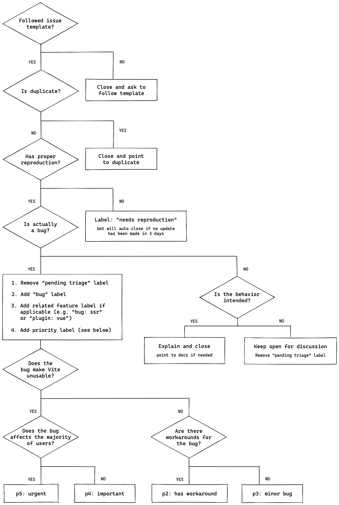
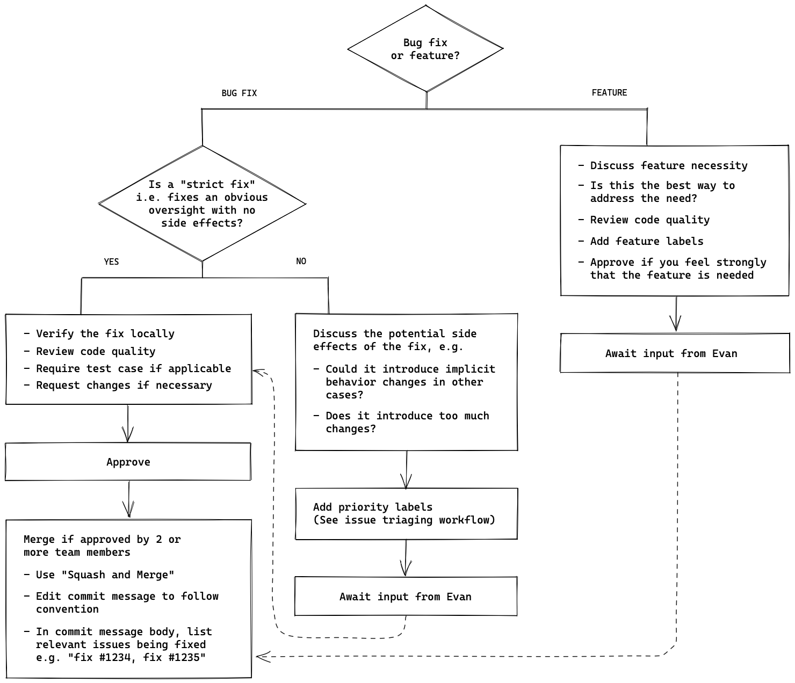

# Vite Contributing Guide

Hi! We're really excited that you're interested in contributing to Vite! Before submitting your contribution, please read through the following guide.

## Repo Setup

The Vite repo is a monorepo using pnpm workspaces. The package manager used to install and link dependencies must be [pnpm](https://pnpm.io/).

To develop and test the core `vite` package:

1. Run `pnpm i` in Vite's root folder.

2. Run `pnpm run build` in Vite's root folder.

3. If you are developing Vite itself, you can go to `packages/vite` and run `pnpm run dev` to automatically rebuild Vite whenever you change its code.

You can alternatively use [Vite.js Docker Dev](https://github.com/nystudio107/vitejs-docker-dev) for a containerized Docker setup for Vite.js development.

> Vite uses pnpm v7. If you are working on multiple projects with different versions of pnpm, it's recommended to enable [Corepack](https://github.com/nodejs/corepack) by running `corepack enable`.

### Ignoring commits when running `git blame`

We have a `.git-blame-ignore-revs` file to ignore formatting changes.
To make this file used by `git blame`, you need to run the following command.

```sh
git config --local blame.ignoreRevsFile .git-blame-ignore-revs
```

## Debugging

To use breakpoints and explore code execution, you can use the ["Run and Debug"](https://code.visualstudio.com/docs/editor/debugging) feature from VS Code.

1. Add a `debugger` statement where you want to stop the code execution.

2. Click the "Run and Debug" icon in the activity bar of the editor, which opens the [_Run and Debug view_](https://code.visualstudio.com/docs/editor/debugging#_run-and-debug-view).

3. Click the "JavaScript Debug Terminal" button in the _Run and Debug view_, which opens a terminal in VS Code.

4. From that terminal, go to `playground/xxx`, and run `pnpm run dev`.

5. The execution will stop at the `debugger` statement, and you can use the [Debug toolbar](https://code.visualstudio.com/docs/editor/debugging#_debug-actions) to continue, step over, and restart the process...

### Debugging Errors in Vitest Tests Using Playwright (Chromium)

Some errors are masked and hidden away because of the layers of abstraction and sandboxed nature added by Vitest, Playwright, and Chromium. In order to see what's actually going wrong and the contents of the devtools console in those instances, follow this setup:

1. Add a `debugger` statement to the `playground/vitestSetup.ts` -> `afterAll` hook. This will pause execution before the tests quit and the Playwright browser instance exits.

2. Run the tests with the `debug-serve` script command, which will enable remote debugging: `pnpm run debug-serve resolve`.

3. Wait for inspector devtools to open in your browser and the debugger to attach.

4. In the sources panel in the right column, click the play button to resume execution, and allow the tests to run, which will open a Chromium instance.

5. Focusing the Chromium instance, you can open the browser devtools and inspect the console there to find the underlying problems.

6. To close everything, just stop the test process back in your terminal.

## Testing Vite against external packages

You may wish to test your locally modified copy of Vite against another package that is built with Vite. For pnpm, after building Vite, you can use [`pnpm.overrides`](https://pnpm.io/package_json#pnpmoverrides) to do this. Note that `pnpm.overrides` must be specified in the root `package.json`, and you must list the package as a dependency in the root `package.json`:

```json
{
  "dependencies": {
    "vite": "^4.0.0"
  },
  "pnpm": {
    "overrides": {
      "vite": "link:../path/to/vite/packages/vite"
    }
  }
}
```

And re-run `pnpm install` to link the package.

## Running Tests

### Integration Tests

Each package under `playground/` contains a `__tests__` directory. The tests are run using [Vitest](https://vitest.dev/) + [Playwright](https://playwright.dev/) with custom integrations to make writing tests simple. The detailed setup is inside `vitest.config.e2e.js` and `playground/vitest*` files.

Before running the tests, make sure that [Vite has been built](#repo-setup). On Windows, you may want to [activate Developer Mode](https://docs.microsoft.com/en-us/windows/apps/get-started/enable-your-device-for-development) to resolve [issues with symlink creation for non-admins](https://github.com/vitejs/vite/issues/7390). Also, you may want to [set git `core.symlinks` to `true` to resolve issues with symlinks in git](https://github.com/vitejs/vite/issues/5242).

Each integration test can be run under either dev server mode or build mode.

- `pnpm test` by default runs every integration test in both serve and build mode, and also unit tests.

- `pnpm run test-serve` runs tests only under serve mode.

- `pnpm run test-build` runs tests only under build mode.

- `pnpm run test-serve [match]` or `pnpm run test-build [match]` runs tests in specific packages that match the given filter. e.g. `pnpm run test-serve asset` runs tests for both `playground/asset` and `vite/src/node/__tests__/asset` under serve mode.

  Note package matching is not available for the `pnpm test` script, which always runs all tests.

### Unit Tests

Other than tests under `playground/` for integration tests, packages might contain unit tests under their `__tests__` directory. Unit tests are powered by [Vitest](https://vitest.dev/). The detailed config is inside `vitest.config.ts` files.

- `pnpm run test-unit` runs unit tests under each package.

- `pnpm run test-unit [match]` runs tests in specific packages that match the given filter.

### Test Env and Helpers

Inside playground tests, you can import the `page` object from `~utils`, which is a Playwright [`Page`](https://playwright.dev/docs/api/class-page) instance that has already navigated to the served page of the current playground. So, writing a test is as simple as:

```js
import { page } from '~utils'

test('should work', async () => {
  expect(await page.textContent('.foo')).toMatch('foo')
})
```

Some common test helpers (e.g. `testDir`, `isBuild`, or `editFile`) are also available in the utils. Source code is located at `playground/test-utils.ts`.

Note: The test build environment uses a [different default set of Vite config](https://github.com/vitejs/vite/blob/main/playground/vitestSetup.ts#L102-L122) to skip transpilation during tests to make it faster. This may produce a different result compared to the default production build.

### Extending the Test Suite

To add new tests, you should find a related playground to the fix or feature (or create a new one). As an example, static assets loading is tested in the [assets playground](https://github.com/vitejs/vite/tree/main/playground/assets). In this Vite app, there is a test for `?raw` imports with [a section defined in the `index.html` for it](https://github.com/vitejs/vite/blob/main/playground/assets/index.html#L121):

```html
<h2>?raw import</h2>
<code class="raw"></code>
```

This will be modified [with the result of a file import](https://github.com/vitejs/vite/blob/main/playground/assets/index.html#L151):

```js
import rawSvg from './nested/fragment.svg?raw'
text('.raw', rawSvg)
```

...where the `text` util is defined as:

```js
function text(el, text) {
  document.querySelector(el).textContent = text
}
```

In the [spec tests](https://github.com/vitejs/vite/blob/main/playground/assets/__tests__/assets.spec.ts#L180), the modifications to the DOM listed above are used to test this feature:

```js
test('?raw import', async () => {
  expect(await page.textContent('.raw')).toMatch('SVG')
})
```

## Note on Test Dependencies

In many test cases, we need to mock dependencies using `link:` and `file:` protocols. `pnpm` treats `link:` as symlinks and `file:` as hardlinks. To test dependencies as if they were copied into `node_modules`, use the `file:` protocol. Otherwise, use the `link:` protocol.

For a mock dependency, make sure you add a `@vitejs/test-` prefix to the package name. This will avoid possible issues like false-positive alerts.

## Debug Logging

You can set the `DEBUG` environment variable to turn on debugging logs (e.g. `DEBUG="vite:resolve"`). To see all debug logs, you can set `DEBUG="vite:*"`, but be warned that it will be quite noisy. You can run `grep -r "createDebugger('vite:" packages/vite/src/` to see a list of available debug scopes.

## Pull Request Guidelines

- Checkout a topic branch from a base branch (e.g. `main`), and merge back against that branch.

- If adding a new feature:

  - Add accompanying test case.
  - Provide a convincing reason to add this feature. Ideally, you should open a suggestion issue first, and have it approved before working on it.

- If fixing a bug:

  - If you are resolving a special issue, add `(fix #xxxx[,#xxxx])` (#xxxx is the issue id) in your PR title for a better release log (e.g. `fix: update entities encoding/decoding (fix #3899)`).
  - Provide a detailed description of the bug in the PR. Live demo preferred.
  - Add appropriate test coverage if applicable.

- It's OK to have multiple small commits as you work on the PR. GitHub can automatically squash them before merging.

- Make sure tests pass!

- No need to worry about code style as long as you have installed the dev dependencies. Modified files are automatically formatted with Prettier on commit (by invoking [Git Hooks](https://git-scm.com/docs/githooks) via [simple-git-hooks](https://github.com/toplenboren/simple-git-hooks)).

- PR title must follow the [commit message convention](./.github/commit-convention.md) so that changelogs can be automatically generated.

## Maintenance Guidelines

> The following section is mostly for maintainers who have commit access, but it's helpful to go through if you intend to make non-trivial contributions to the codebase.

### Issue Triaging Workflow

<picture>
  <source media="(prefers-color-scheme: dark)" srcset="./.github/issue-workflow-dark.png">
  
</picture>

### Pull Request Review Workflow

<picture>
  <source media="(prefers-color-scheme: dark)" srcset="./.github/pr-workflow-dark.png">
  
</picture>

## Notes on Dependencies

Vite aims to be lightweight, and this includes being aware of the number of npm dependencies and their size.

We use Rollup to pre-bundle most dependencies before publishing! Therefore, most dependencies, even those used in runtime source code, should be added under `devDependencies` by default. This also creates the following constraints that we need to be aware of in the codebase.

### Usage of `require()`

In some cases, we intentionally lazy-require some dependencies to improve start-up performance. However, note that we cannot use simple `require('somedep')` calls since these are ignored in ESM files, so the dependency won't be included in the bundle, and the actual dependency won't even be there when published since they are in `devDependencies`.

Instead, use `(await import('somedep')).default`.

### Think Before Adding a Dependency

Most deps should be added to `devDependencies` even if they are needed at runtime. Some exceptions are:

- Type packages. Example: `@types/*`.
- Deps that cannot be properly bundled due to binary files. Example: `esbuild`.
- Deps that ship their own types that are used in Vite's own public types. Example: `rollup`.

Avoid deps with large transitive dependencies that result in bloated size compared to the functionality it provides. For example, `http-proxy` itself plus `@types/http-proxy` is a little over 1MB in size, but `http-proxy-middleware` pulls in a ton of dependencies that make it 7MB(!) when a minimal custom middleware on top of `http-proxy` only requires a couple of lines of code.

### Ensure Type Support

Vite aims to be fully usable as a dependency in a TypeScript project (e.g. it should provide proper typings for VitePress), and also in `vite.config.ts`. This means technically a dependency whose types are exposed needs to be part of `dependencies` instead of `devDependencies`. However, this also means we won't be able to bundle it.

To get around this, we inline some of these dependencies' types in `packages/vite/src/types`. This way, we can still expose the typing but bundle the dependency's source code.

Use `pnpm run build-types-check` to check that the bundled types do not rely on types in `devDependencies`.

For types shared between client and node, they should be added into `packages/vite/types`. These types are not bundled and are published as is (though they are still considered internal). Dependency types within this directory (e.g. `packages/vite/types/chokidar.d.ts`) are deprecated and should be added to `packages/vite/src/types` instead.

### Think Before Adding Yet Another Option

We already have many config options, and we should avoid fixing an issue by adding yet another one. Before adding an option, consider whether the problem:

- is really worth addressing
- can be fixed with a smarter default
- has workaround using existing options
- can be addressed with a plugin instead

## Docs Translation Contribution

To add a new language to the Vite docs, see [`vite-docs-template`](https://github.com/tony19/vite-docs-template/blob/main/.github/CONTRIBUTING.md).
