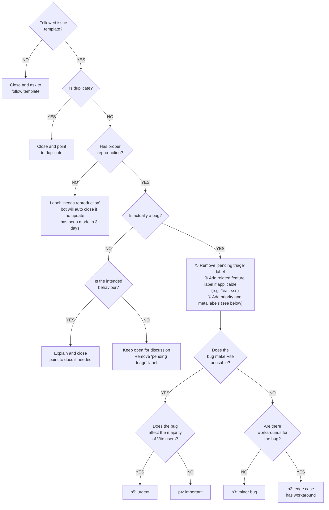
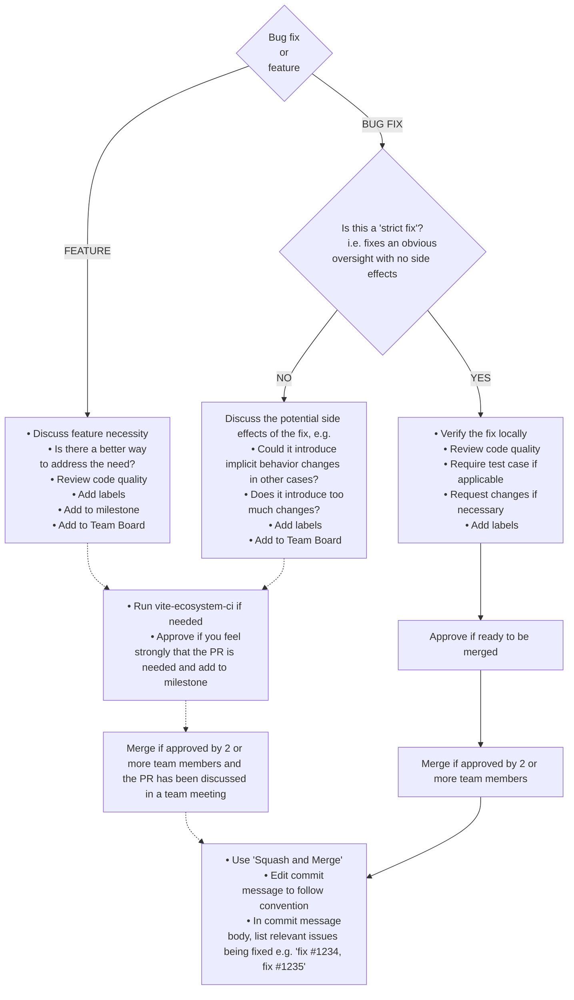

# Vite Contributing Guide

Hi! We're really excited that you're interested in contributing to Vite! Before submitting your contribution, please read through the following guide. We also suggest you read the [Project Philosophy](https://vite.dev/guide/philosophy) in our documentation.

## Repo Setup

To develop locally, fork the Vite repository and clone it in your local machine. The Vite repo is a monorepo using pnpm workspaces. The package manager used to install and link dependencies must be [pnpm](https://pnpm.io/). You can find the required pnpm version in `package.json` under the `packageManager` key.

To develop and test the core `vite` package:

1. Run `pnpm i` in Vite's root folder.

2. Run `pnpm run build` in Vite's root folder.

3. If you are developing Vite itself, you can go to `packages/vite` and run `pnpm run dev` to automatically rebuild Vite whenever you change its code.

> If you are working on multiple projects with different versions of pnpm, it's recommended to enable [Corepack](https://github.com/nodejs/corepack) by running `corepack enable`.

### Cloning the repo on Windows

On Windows, you may want to [activate Developer Mode](https://docs.microsoft.com/en-us/windows/apps/get-started/enable-your-device-for-development) to resolve [issues with symlink creation for non-admins](https://github.com/vitejs/vite/issues/7390). Also, you may want to [set git `core.symlinks` to `true` to resolve issues with symlinks in git](https://github.com/vitejs/vite/issues/5242).

### Ignoring commits when running `git blame`

We have a `.git-blame-ignore-revs` file to ignore formatting changes.
To make this file used by `git blame`, you need to run the following command.

```sh
git config --local blame.ignoreRevsFile .git-blame-ignore-revs
```

## Documentation

To develop the `docs/` site:

1. Run `pnpm run build` in Vite's root folder. This will generate the types for `twoslash` to work in the code examples. If the types are not available, errors will be logged in step 2 but does not prevent the site from working.

2. Run `pnpm run docs` in Vite's root folder.

### Docs Translation Contribution

To add a new language to the Vite docs, see [`vite-docs-template`](https://github.com/tony19/vite-docs-template/blob/main/.github/CONTRIBUTING.md).

## Notes on Dependencies

Vite aims to be lightweight, and this includes being aware of the number of npm dependencies and their size.

We use Rolldown to pre-bundle most dependencies before publishing! Therefore, most dependencies, even those used in runtime source code, should be added under `devDependencies` by default. This also creates the following constraints that we need to be aware of in the codebase.

### Usage of `require()`

In some cases, we intentionally lazy-require some dependencies to improve start-up performance. However, note that we cannot use simple `require('somedep')` calls since these are ignored in ESM files, so the dependency won't be included in the bundle, and the actual dependency won't even be there when published since they are in `devDependencies`.

Instead, use `(await import('somedep')).default`.

### Think Before Adding a Dependency

Most deps should be added to `devDependencies` even if they are needed at runtime. Some exceptions are:

- Type packages. Example: `@types/*`.
- Deps that cannot be properly bundled due to binary files. Example: `rolldown`, `lightningcss`.
- Deps that ship their own types that are used in Vite's own public types. Example: `rolldown`.

Avoid deps with large transitive dependencies that result in bloated size compared to the functionality it provides. For example, `http-proxy` itself is around 380kB in size, but `http-proxy-middleware` pulls in a ton of dependencies that make it 3MB(!) when a minimal custom middleware on top of `http-proxy` only requires a couple of lines of code.

### Ensure Type Support

Vite aims to be fully usable as a dependency in a TypeScript project (e.g. it should provide proper typings for VitePress), and also in `vite.config.ts`. This means technically a dependency whose types are exposed needs to be part of `dependencies` instead of `devDependencies`. However, this also means we won't be able to bundle it.

To get around this, we inline some of these dependencies' types in `packages/vite/src/types`. This way, we can still expose the typing but bundle the dependency's source code.

Use `pnpm run build-types-check` to check that the bundled types do not rely on types in `devDependencies`.

For types shared between client and node, they should be added into `packages/vite/types`. These types are not bundled and are published as is (though they are still considered internal).

## Think Before Adding Yet Another Option

We already have many config options, and we should avoid fixing an issue by adding yet another one. Before adding an option, consider whether the problem:

- is really worth addressing
- can be fixed with a smarter default
- has workaround using existing options
- can be addressed with a plugin instead

## Debugging

To use breakpoints and explore code execution, you can use the ["Run and Debug"](https://code.visualstudio.com/docs/editor/debugging) feature from VS Code.

1. Add a `debugger` statement where you want to stop the code execution.

2. Click the "Run and Debug" icon in the activity bar of the editor, which opens the [_Run and Debug view_](https://code.visualstudio.com/docs/editor/debugging#_run-and-debug-view).

3. Click the "JavaScript Debug Terminal" button in the _Run and Debug view_, which opens a terminal in VS Code.

4. From that terminal, go to `playground/xxx`, and run `pnpm run dev`.

5. The execution will stop at the `debugger` statement, and you can use the [Debug toolbar](https://code.visualstudio.com/docs/editor/debugging#_debug-actions) to continue, step over, and restart the process...

### Debugging Errors in Vitest Tests Using Playwright (Chromium)

Some errors are masked and hidden away because of the layers of abstraction and sandboxed nature added by Vitest, Playwright, and Chromium. In order to see what's actually going wrong and the contents of the devtools console in those instances, follow this setup:

1. Add a `debugger` statement to the `playground/vitestSetup.ts` -> `afterAll` hook. This will pause execution before the tests quit and the Playwright browser instance exits.

2. Run the tests with the `debug-serve` script command, which will enable remote debugging: `pnpm run debug-serve resolve`.

3. Wait for inspector devtools to open in your browser and the debugger to attach.

4. In the sources panel in the right column, click the play button to resume execution, and allow the tests to run, which will open a Chromium instance.

5. Focusing the Chromium instance, you can open the browser devtools and inspect the console there to find the underlying problems.

6. To close everything, just stop the test process back in your terminal.

### Debug Logging

You can set the `--debug` option to turn on debugging logs (e.g. `vite --debug resolve`). To see all debug logs, you can set `vite --debug *`, but be warned that it will be quite noisy. You can run `grep -r "createDebugger('vite:" packages/vite/src/` to see a list of available debug scopes.

### Disabling Source Maps

Source maps for Vite's source code are enabled by default when Vite is placed outside `node_modules` so that you can easily debug it. When bundling Vite in watch mode, source maps will be generated.

However, this behavior may not be desirable when you are developing source map related features. In that case, you can disable source maps by setting the `DEBUG_DISABLE_SOURCE_MAP` environment variable to `1` when running Vite (e.g. `DEBUG_DISABLE_SOURCE_MAP=1 vite`). This environment variable can also be used to disable source map generation.

## Testing Vite against external packages

You may wish to test your locally modified copy of Vite against another package that is built with Vite. For pnpm, after building Vite, you can use [`overrides`](https://pnpm.io/settings#overrides) to do this. In pnpm v10.5+, `overrides` should be specified in the root `pnpm-workspace.yaml`, and you must list the package as a dependency in the root `package.json`:

```yaml
# pnpm-workspace.yaml
overrides:
  vite: link:../path/to/vite/packages/vite
```

And re-run `pnpm install` to link the package.

## Running Tests

### Integration Tests

Each package under `playground/` contains a `__tests__` directory. The tests are run using [Vitest](https://vitest.dev/) + [Playwright](https://playwright.dev/) with custom integrations to make writing tests simple. The detailed setup is inside `vitest.config.e2e.ts` and `playground/vitest*.ts` files.

Some playgrounds define variants to run the same app using different config setups. By convention, when running a test spec file in a nested folder in `__tests__`, the setup will try to use a config file named `vite.config-{folderName}.js` at the playground's root. You can see an example of variants in the [assets playground](https://github.com/vitejs/vite/tree/main/playground/assets).

Before running the tests, make sure that [Vite has been built](#repo-setup).

Each integration test can be run under either dev server mode or build mode.

- `pnpm test` by default runs every integration test in both serve and build mode, and also unit tests.

- `pnpm run test-serve` runs tests only under serve mode.

- `pnpm run test-build` runs tests only under build mode.

- `pnpm run test-serve-bundled` runs tests under serve mode with `experimental.bundledDev` force-enabled (no separate configs needed). Spec files that do not pass in this mode yet are listed in `bundledDevExclude` in `vitest.config.e2e.ts` — remove a file from that list once it passes. When only a few cases in a file fail, keep the file out of that list and mark those cases with `test.skipIf(isBundledDev)` (or `describe.skipIf(isBundledDev)`) using the `isBundledDev` flag from `~utils` — they still run in the normal serve and build modes.

`pnpm run test-serve [match]` or `pnpm run test-build [match]` runs tests in specific packages that match the given filter. e.g. `pnpm run test-serve assets` runs tests for both `playground/assets` and `playground/assets-sanitize` under serve mode. Note package matching is not available for the `pnpm test` script, which always runs all tests.

### Unit Tests

Other than tests under `playground/` for integration tests, packages might contain unit tests under their `__tests__` directory. Unit tests are powered by [Vitest](https://vitest.dev/). The detailed config is inside `vitest.config.ts` files.

- `pnpm run test-unit` runs unit tests under each package.

`pnpm run test-unit [match]` runs tests in specific packages that match the given filter.

### Test Env and Helpers

Inside playground tests, you can import the `page` object from `~utils`, which is a Playwright [`Page`](https://playwright.dev/docs/api/class-page) instance that has already navigated to the served page of the current playground. So, writing a test is as simple as:

```js
import { page } from '~utils'

test('should work', async () => {
  expect(await page.textContent('.foo')).toMatch('foo')
})
```

Some common test helpers (e.g. `testDir`, `isBuild`, or `editFile`) are also available in the utils. Source code is located at `playground/test-utils.ts`.

> [!NOTE]
> The dev server's file watcher runs in polling mode during tests. Polling (chokidar) only registers a file as changed when its size differs or its mtime strictly increases. On some platforms a quick in-place rewrite may not report an advanced mtime, so an edit that keeps the exact same byte length can be missed, and the expected HMR update or rebuild never fires (causing flaky timeouts). To enforce this, `editFile` throws if your replacement leaves the file's byte length unchanged; make the edit change the size (for example by adding a trailing space or an extra character that doesn't affect the test's semantics). If you trigger a watched change by some other means, make sure the edit changes the file's byte length.

Note: The test build environment uses a [different default set of Vite config](https://github.com/vitejs/vite/blob/v8.1.5/playground/vitestSetup.ts#L264-L268) to skip transpilation during tests to make it faster. This may produce a different result compared to the default production build.

### Extending the Test Suite

To add new tests, you should find a related playground to the fix or feature (or create a new one). As an example, static assets loading is tested in the [assets playground](https://github.com/vitejs/vite/tree/main/playground/assets). In this Vite app, there is a test for `?raw` imports with [a section defined in the `index.html` for it](https://github.com/vitejs/vite/blob/v8.1.5/playground/assets/index.html#L270-L271):

```html
<h2>?raw import</h2>
<code class="raw"></code>
```

This will be modified [with the result of a file import](https://github.com/vitejs/vite/blob/v8.1.5/playground/assets/index.html#L557-L558):

```js
import rawSvg from './nested/fragment.svg?raw'
text('.raw', rawSvg)
```

...where the `text` util is defined as:

```js
function text(el, text) {
  document.querySelector(el).textContent = text
}
```

In the [spec tests](https://github.com/vitejs/vite/blob/v8.1.5/playground/assets/__tests__/assets.spec.ts#L483-L485), the modifications to the DOM listed above are used to test this feature:

```js
test('?raw import', async () => {
  expect(await page.textContent('.raw')).toMatch('SVG')
})
```

### Note on Test Dependencies

In many test cases, we need to mock dependencies using `link:` and `file:` protocols. `pnpm` treats `link:` as symlinks and `file:` as hardlinks. To test dependencies as if they were copied into `node_modules`, use the `file:` protocol. Otherwise, use the `link:` protocol.

For a mock dependency, make sure you add a `@vitejs/test-` prefix to the package name. This will avoid possible issues like false-positive alerts.

## AI Policy

<!-- Adapted from https://github.com/nuxt/nuxt/blob/main/CONTRIBUTING.md#ai-assisted-contributions -->

We welcome the thoughtful use of AI tools when contributing to Vite, but ask all contributors to follow [two core principles](https://roe.dev/blog/using-ai-in-open-source):

1. **Never let an LLM speak for you** - all comments, issues, and PR descriptions should be written in your own words, reflecting your own understanding.
2. **Never let an LLM think for you** - only submit contributions you fully understand and can explain.

If we find that these principles were not followed, we may close the issue or pull request directly.

## Pull Request Guidelines

> [!NOTE]
> You do not need to ask for permission to work on an open issue. You can start investigating or open a PR directly. If someone else ships a fix first, you can still help by reviewing or validating the solution.

- Checkout a topic branch from a base branch (e.g. `main`), and merge back against that branch.

- If adding a new feature:
  - Add accompanying test case.
  - Provide a convincing reason to add this feature. Ideally, you should open a suggestion issue first, and have it approved before working on it.

- If fixing a bug:
  - If you are resolving a special issue, add `(fix #xxxx[,#xxxx])` (#xxxx is the issue id) in your PR title for a better release log (e.g. `fix: update entities encoding/decoding (fix #3899)`).
  - Provide a detailed description of the bug in the PR. Live demo preferred.
  - Add appropriate test coverage. If not applicable, explain in the PR description why tests are not included.

- If it's a chore:
  - For typos and comment changes, try to combine multiple of them into a single PR.
  - **Note that we discourage contributors from submitting code refactors that are largely stylistic.** Code refactors are only accepted if it improves performance, or objectively improves code quality (e.g. makes a related bug fix or feature implementation easier, and it is as a separate PR to improve git history).
    - The reason is that code readability is subjective. The maintainers of this project have chosen to write the code in its current style based on our preferences, and we do not want to spend time explaining our stylistic preferences. Contributors should just respect the established conventions when contributing code. Another aspect of it is that large scale stylistic changes result in massive diffs that touch multiple files, adding noise to the git history and makes tracing behavior changes across commits more cumbersome.

- It's OK to have multiple small commits as you work on the PR. GitHub can automatically squash them before merging.

- Make sure tests pass!

- No need to worry about code style as long as you have installed the dev dependencies. Modified files are automatically formatted with Oxfmt on commit (by invoking [Git Hooks](https://git-scm.com/docs/githooks) via [simple-git-hooks](https://github.com/toplenboren/simple-git-hooks)).

- PR title must follow the [commit message convention](./.github/commit-convention.md) so that changelogs can be automatically generated.

## Maintenance Guidelines

> The following section is mostly for maintainers who have commit access, but it's helpful to go through if you intend to make non-trivial contributions to the codebase.

### Issue Triaging Workflow


```mermaid
flowchart TD
    start{Followed issue
        template?}
    start --NO--> close1["Close and ask to
        follow template"]
    start --YES--> dupe{Is duplicate?}
    dupe --YES--> close2[Close and point
        to duplicate]
    dupe --NO--> repro{Has proper
      reproduction?}
    repro --NO--> close3[Label: 'needs reproduction'
        bot will auto close if no update
        has been made in 3 days]
    repro --YES--> real{Is actually a bug?}
    real --NO--> intended{Is the intended
        behaviour?}
    intended --YES--> explain[Explain and close
        point to docs if needed]
    intended --NO--> open[Keep open for discussion
        Remove 'pending triage' label]
    real --YES--> real2["① Remove 'pending triage' label
        ② Add related feature label if applicable
        (e.g. 'feat: ssr')
        ③ Add priority and meta labels (see below)"]
    real2 --> unusable{Does the
        bug make Vite
        unusable?}
    unusable --YES--> maj{Does the bug
        affect the majority
        of Vite users?}
    maj --YES--> p5[p5: urgent]
    maj --NO--> p4[p4: important]
    unusable --NO--> workarounds{Are there
        workarounds for
        the bug?}
    workarounds --NO--> p3[p3: minor bug]
    workarounds --YES--> p2[p2: edge case
        has workaround]
```

### Pull Request Review Workflow


```mermaid
flowchart TD
    start{Bug fix
        or
        feature}
    start --BUG FIX--> strict_bug{"Is this a 'strict fix'?
        i.e. fixes an obvious oversight with no side effects"}
    start --FEATURE--> feature[• Discuss feature necessity
        • Is there a better way to address the need?
        • Review code quality
        • Add labels
        • Add to milestone
        • Add to Team Board]
    feature -.-> approve_non_strict[• Run vite-ecosystem-ci if needed
        • Approve if you feel strongly that the PR is needed and add to milestone]
    strict_bug --YES--> strict[• Verify the fix locally
        • Review code quality
        • Require test case if applicable
        • Request changes if necessary
        • Add labels]
    strict_bug --NO--> non_strict[Discuss the potential side effects of the fix, e.g.
        • Could it introduce implicit behavior changes in other cases?
        • Does it introduce too much changes?
        • Add labels
        • Add to Team Board]
    non_strict -.-> approve_non_strict
    strict --> approve_strict[Approve if ready to be merged]
    approve_strict --> merge_strict[Merge if approved by 2 or more team members]
    approve_non_strict -.-> merge_non_strict[Merge if approved by 2 or more team members and the PR has been discussed in a team meeting]
    merge_non_strict -.-> merge_extra
    merge_strict --> merge_extra["• Use 'Squash and Merge'
        • Edit commit message to follow convention
        • In commit message body, list relevant issues being fixed e.g. 'fix #1234, fix #1235'"]
```

### Release

All publishable packages in this repository use a pull-request-driven release flow. GitHub Actions prepares a release PR containing the version bump and changelog, and merging that PR triggers publishing.

#### Prepare a Release

1. Run the [Prepare Release](.github/workflows/prepare-release.yml) workflow from the `main` branch.
2. Select `vite`, `create-vite`, or `plugin-legacy`.
3. Select a `release` type. The default `next` creates the next patch for a stable version or advances an existing prerelease. Alternatively, select another supported release type or enter an exact `version`, which takes precedence over `release`.
4. Wait for the action to open the release PR. The PR contains the selected package's version bump and changelog entry. A `create-vite` release also updates template Vite dependency versions when appropriate.

#### Review and Publish

1. Review the generated version and changelog, and wait for the release PR checks to pass.
2. Merge the PR while retaining its `release: <tag>` commit subject. Vite uses `release: v<version>`; other packages use `release: <package>@<version>`. A matching commit at the tip of `main` triggers the publish job.
3. Open the [Publish Package](.github/workflows/publish.yml) run and approve its `Release` environment deployment.
4. Wait for the workflow to publish the package, create its tag, and create the corresponding GitHub release.
5. Verify the new version on npm.

#### Repository Configuration

The release flow depends on configuration outside this repository:

- The `Release` environment must require maintainer approval before publishing.
- The npm trusted publishers for `vite`, `create-vite`, and `@vitejs/plugin-legacy` must be restricted to `vitejs/vite`, `.github/workflows/publish.yml`, and the `Release` environment.

#### Recovery

- If release preparation fails, fix the cause and rerun the preparation workflow. Each run creates a uniquely named branch.
- If publishing fails before npm accepts the package, fix the cause and rerun the failed workflow.
- If npm publishing succeeds but tag or GitHub release creation fails, do not rerun the entire publish job blindly because npm versions are immutable. Confirm the package state first, then manually create the tag at the original release commit and create the GitHub release from the corresponding changelog entry.
- If the release tag already exists, investigate whether the package was previously published before retrying or changing any release state.

To learn more about how and when Vite does releases, check out the [Releases](https://vite.dev/releases) documentation.
