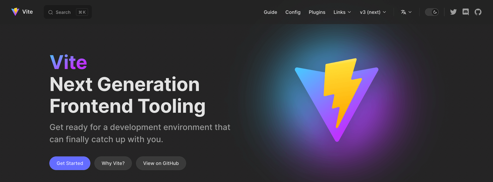
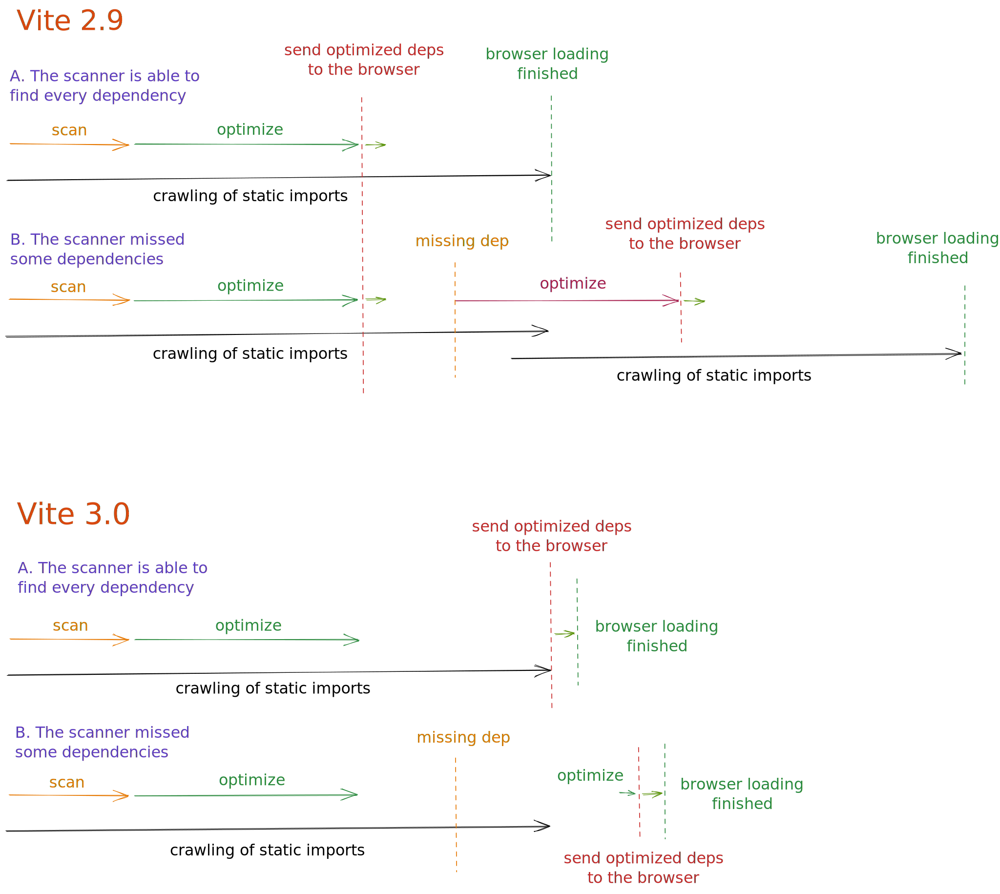
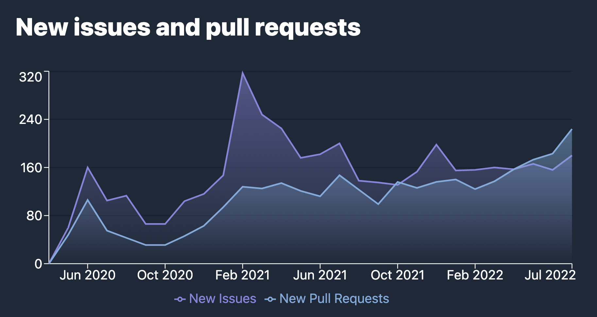

# Vite 3.0 is out!

In February last year, [Evan You](https://twitter.com/youyuxi) released Vite 2. Since then, its adoption has grown non-stop, reaching more than 1 million npm downloads per week. A sprawling ecosystem rapidly formed after the release. Vite is powering a renewed innovation race in Web frameworks. [Nuxt 3](https://v3.nuxtjs.org/) uses Vite by default. [SvelteKit](https://kit.svelte.dev/), [Astro](https://astro.build/), [Hydrogen](https://hydrogen.shopify.dev/), and [SolidStart](https://docs.solidjs.com/start) are all built with Vite. [Laravel has now decided to use Vite by default](https://laravel.com/docs/9.x/vite). [Vite Ruby](https://vite-ruby.netlify.app/) shows how Vite can improve Rails DX. [Vitest](https://vitest.dev) is making strides as a Vite-native alternative to Jest. Vite is behind [Cypress](https://docs.cypress.io/guides/component-testing/writing-your-first-component-test) and [Playwright](https://playwright.dev/docs/test-components)'s new Component Testing features, Storybook has [Vite as an official builder](https://github.com/storybookjs/builder-vite). And [the list goes on](https://patak.dev/vite/ecosystem.html). Maintainers from most of these projects got involved in improving the Vite core itself, working closely with the Vite [team](https://vitejs.dev/team) and other contributors.


Today, 16 months from the v2 launch we are happy to announce the release of Vite 3. We decided to release a new Vite major at least every year to align with [Node.js's EOL](https://nodejs.org/en/about/releases/), and take the opportunity to review Vite's API regularly with a short migration path for projects in the ecosystem.

Quick links:

- [Docs](/)
- [Migration Guide](/guide/migration)
- [Changelog](https://github.com/vitejs/vite/blob/main/packages/vite/CHANGELOG.md#300-2022-07-13)

If you are new to Vite, we recommend reading the [Why Vite Guide](https://vitejs.dev/guide/why.html). Then check out [the Getting Started](https://vitejs.dev/guide/) and [Features guide](https://vitejs.dev/guide/features) to see what Vite provides out of the box. As usual, contributions are welcome at [GitHub](https://github.com/vitejs/vite). More than [600 collaborators](https://github.com/vitejs/vite/graphs/contributors) have helped improve Vite so far. Follow the updates on [Twitter](https://twitter.com/vite_js), or join discussions with other Vite users on our [Discord chat server](http://chat.vitejs.dev/).

## New Documentation

Go to [vitejs.dev](https://vitejs.dev) to enjoy the new v3 docs. Vite is now using the new [VitePress](https://vitepress.vuejs.org) default theme, with a stunning dark mode between other features.

[](https://vitejs.dev)

Several projects in the ecosystem have already migrated to it (see [Vitest](https://vitest.dev), [vite-plugin-pwa](https://vite-plugin-pwa.netlify.app/), and [VitePress](https://vitepress.vuejs.org/) itself).

If you need to access the Vite 2 docs, they will remain online at [v2.vitejs.dev](https://v2.vitejs.dev). There is also a new [main.vitejs.dev](https://main.vitejs.dev) subdomain, where each commit to Vite’s main branch is auto deployed. This is useful when testing beta versions or contributing to the core’s development.

There is also now an official Spanish translation, that has been added to the previous Chinese and Japanese translations:

- [简体中文](https://cn.vitejs.dev/)
- [日本語](https://ja.vitejs.dev/)
- [Español](https://es.vitejs.dev/)

## Create Vite Starter Templates

[create-vite](/guide/#trying-vite-online) templates have been a great tool to quickly test Vite with your favorite framework. In Vite 3, all of the templates got a new theme in line with the new docs. Open them online and start playing with Vite 3 now:

<div class="stackblitz-links">
<a target="_blank" href="https://vite.new"></a>
<a target="_blank" href="https://vite.new/vue"></a>
<a target="_blank" href="https://vite.new/svelte"></a>
<a target="_blank" href="https://vite.new/react"></a>
<a target="_blank" href="https://vite.new/preact"></a>
<a target="_blank" href="https://vite.new/lit"></a>
</div>

<style>
.stackblitz-links {
  display: flex;
  width: 100%;
  justify-content: space-around;
  align-items: center;
}
@media screen and (max-width: 550px) {
  .stackblitz-links {
    display: grid;
    grid-template-columns: 1fr 1fr 1fr;
    width: 100%;
    gap: 2rem;
    padding-left: 3rem;
    padding-right: 3rem;
  }
}
.stackblitz-links > a {
  width: 70px;
  height: 70px;
  display: grid;
  align-items: center;
  justify-items: center;
}
.stackblitz-links > a:hover {
  filter: drop-shadow(0 0 0.5em #646cffaa);
}
</style>

The theme is now shared by all templates. This should help better convey the scope for these starters as minimal templates to get started with Vite. For more complete solutions including linting, testing setup, and other features, there are official Vite-powered templates for some frameworks like [create-vue](https://github.com/vuejs/create-vue) and [create-svelte](https://github.com/sveltejs/kit). There is a community-maintained list of templates at [Awesome Vite](https://github.com/vitejs/awesome-vite#templates).

## Dev Improvements

### Vite CLI

<pre style="background-color: var(--vp-code-block-bg);padding:2em;border-radius:8px;max-width: 100%">
  <span style="color:lightgreen"><b>VITE</b></span> <span style="color:lightgreen">v3.0.0</span>  <span style="color:gray">ready in <b>320</b> ms</span>

  <span style="color:lightgreen"><b>➜</b></span>  <span style="color:white"><b>Local</b>:</span>   <span style="color:cyan">http://127.0.0.1:5173/</span>
  <span style="color:green"><b>➜</b></span>  <span style="color:gray"><b>Network</b>: use --host to expose</span>
</pre>

Apart from the CLI’s aesthetics improvements, you’ll notice that the default dev server port is now 5173 and the preview server listening at 4173. This change ensures Vite will avoid collisions with other tools.

### Improved WebSocket Connection Strategy

One of the pain points of Vite 2 was configuring the server when running behind a proxy. Vite 3 changes the default connection scheme so it works out of the box in most scenarios. All these setups are now tested as part of the Vite Ecosystem CI through [`vite-setup-catalogue`](https://github.com/sapphi-red/vite-setup-catalogue).

### Cold Start Improvements

Vite now avoids full reload during cold start when imports are injected by plugins while crawling the initial statically imported modules ([#8869](https://github.com/vitejs/vite/issues/8869)).

<details>
  <summary><b>Click to learn more</b></summary>

In Vite 2.9, both the scanner and optimizer were run in the background. In the best scenario, where the scanner would find every dependency, no reload was needed in cold start. But if the scanner missed a dependency, a new optimization phase and then a reload were needed. Vite was able to avoid some of these reloads in v2.9, as we detected if the new optimized chunks were compatible with the ones the browser had. But if there was a common dep, the sub-chunks could change and a reload was required to avoid duplicated state. In Vite 3, the optimized deps aren't handed to the browser until the crawling of static imports is done. A quick optimization phase is issued if there is a missing dep (for example, injected by a plugin), and only then, the bundled deps are sent. So, a page reload is no longer needed for these cases.

</details>



### import.meta.glob

`import.meta.glob` support was rewritten. Read about the new features in the [Glob Import Guide](/guide/features.html#glob-import):

[Multiple Patterns](/guide/features.html#multiple-patterns) can be passed as an array

```js
import.meta.glob(['./dir/*.js', './another/*.js'])
```

[Negative Patterns](/guide/features.html#negative-patterns) are now supported (prefixed with `!`) to ignore some specific files

```js
import.meta.glob(['./dir/*.js', '!**/bar.js'])
```

[Named Imports](/guide/features.html#named-imports) can be specified to improve tree-shaking

```js
import.meta.glob('./dir/*.js', { import: 'setup' })
```

[Custom Queries](/guide/features.html#custom-queries) can be passed to attach metadata

```js
import.meta.glob('./dir/*.js', { query: { custom: 'data' } })
```

[Eager Imports](/guide/features.html#glob-import) is now passed as a flag

```js
import.meta.glob('./dir/*.js', { eager: true })
```

### Aligning WASM Import with Future Standards

The WebAssembly import API has been revised to avoid collisions with future standards and to make it more flexible:

```js
import init from './example.wasm?init'

init().then((instance) => {
  instance.exports.test()
})
```

Learn more in the [WebAssembly guide](/guide/features.html#webassembly)

## Build Improvements

### ESM SSR Build by Default

Most SSR frameworks in the ecosystem were already using ESM builds. So, Vite 3 makes ESM the default format for SSR builds. This allows us to streamline previous [SSR externalization heuristics](https://vitejs.dev/guide/ssr.html#ssr-externals), externalizing dependencies by default.

### Improved Relative Base Support

Vite 3 now properly supports relative base (using `base: ''`), allowing built assets to be deployed to different bases without re-building. This is useful when the base isn't known at build time, for example when deploying to content-addressable networks like [IPFS](https://ipfs.io/).

## Experimental Features

### Built Asset Paths fine-grained Control (Experimental)

There are other deploy scenarios where this isn't enough. For example, if the generated hashed assets need to be deployed to a different CDN from the public files, then finer-grained control is required over path generation at build time. Vite 3 provides an experimental API to modify the built file paths. Check [Build Advanced Base Options](/guide/build.html#advanced-base-options) for more information.

### Esbuild Deps Optimization at Build Time (Experimental)

One of the main differences between dev and build time is how Vite handles dependencies. During build time, [`@rollupjs/plugin-commonjs`](https://github.com/rollup/plugins/tree/master/packages/commonjs) is used to allow importing CJS only dependencies (like React). When using the dev server, esbuild is used instead to pre-bundle and optimize dependencies, and an inline interop scheme is applied while transforming user code importing CJS deps. During the development of Vite 3, we introduced the changes needed to also allow the use of [esbuild to optimize dependencies during build time](/guide/migration.html#using-esbuild-deps-optimization-at-build-time). [`@rollupjs/plugin-commonjs`](https://github.com/rollup/plugins/tree/master/packages/commonjs) can then be avoided, making dev and build time work in the same way.

Given that Rollup v3 will be out in the next months, and we're going to follow up with another Vite major, we've decided to make this mode optional to reduce v3 scope and give Vite and the ecosystem more time to work out possible issues with the new CJS interop approach during build time. Frameworks may switch to using esbuild deps optimization during build time by default at their own pace before Vite 4.

### HMR Partial Accept (Experimental)

There is opt-in support for [HMR Partial Accept](https://github.com/vitejs/vite/pull/7324). This feature could unlock finer-grained HMR for framework components that export several bindings in the same module. You can learn more at [the discussion for this proposal](https://github.com/vitejs/vite/discussions/7309).

## Bundle Size Reduction

Vite cares about its publish and install footprint; a fast installation of a new app is a feature. Vite bundles most of its dependencies and tries to use modern lightweight alternatives where possible. Continuing with this ongoing goal, Vite 3 publish size is 30% smaller than v2.

|             | Publish Size | Install Size |
| ----------- | :----------: | :----------: |
| Vite 2.9.14 |    4.38MB    |    19.1MB    |
| Vite 3.0.0  |    3.05MB    |    17.8MB    |
| Reduction   |     -30%     |     -7%      |

In part, this reduction was possible by making some dependencies that most users weren't needing optional. First, [Terser](https://github.com/terser/terser) is no longer installed by default. This dependency was no longer needed since we already made esbuild the default minifier for both JS and CSS in Vite 2. If you use `build.minify: 'terser'`, you'll need to install it (`npm add -D terser`). We also moved [node-forge](https://github.com/digitalbazaar/forge) out of the monorepo, implementing support for automatic https certificate generation as a new plugin: [`@vitejs/plugin-basic-ssl`](/guide/migration.html#automatic-https-certificate-generation). Since this feature only creates untrusted certificates that are not added to the local store, it didn't justify the added size.

## Bug Fixing

A triaging marathon was spearheaded by [@bluwyoo](https://twitter.com/bluwyoo), [@sapphi_red](https://twitter.com/sapphi_red), that recently joined the Vite team. During the past three months, the Vite open issues were reduced from 770 to 400. And this dive was achieved while the newly open PRs were at an all-time high. At the same time, [@haoqunjiang](https://twitter.com/haoqunjiang) had also curated a comprehensive [overview of Vite issues](https://github.com/vitejs/vite/discussions/8232).

[](https://www.repotrends.com/vitejs/vite)

[](https://www.repotrends.com/vitejs/vite)

## Compatibility Notes

- Vite no longer supports Node.js 12 / 13 / 15, which reached its EOL. Node.js 14.18+ / 16+ is now required.
- Vite is now published as ESM, with a CJS proxy to the ESM entry for compatibility.
- The Modern Browser Baseline now targets browsers which support the [native ES Modules](https://caniuse.com/es6-module), [native ESM dynamic import](https://caniuse.com/es6-module-dynamic-import), and [`import.meta`](https://caniuse.com/mdn-javascript_statements_import_meta) features.
- JS file extensions in SSR and library mode now use a valid extension (`js`, `mjs`, or `cjs`) for output JS entries and chunks based on their format and the package type.

Learn more in the [Migration Guide](/guide/migration).

## Upgrades to Vite Core

While working towards Vite 3, we also improved the contributing experience for collaborators to [Vite Core](https://github.com/vitejs/vite).

- Unit and E2E tests have been migrated to [Vitest](https://vitest.dev), providing a faster and more stable DX. This move also works as dog fooding for an important infrastructure project in the ecosystem.
- VitePress build is now tested as part of CI.
- Vite upgraded to [pnpm 7](https://pnpm.io/), following the rest of the ecosystem.
- Playgrounds have been moved to [`/playgrounds`](https://github.com/vitejs/vite/tree/main/playground) out of packages directory.
- The packages and playgrounds are now `"type": "module"`.
- Plugins are now bundled using [unbuild](https://github.com/unjs/unbuild), and [plugin-vue-jsx](https://github.com/vitejs/vite/tree/main/packages/plugin-vue-jsx) and [plugin-legacy](https://github.com/vitejs/vite/tree/main/packages/plugin-legacy) were moved to TypeScript.

## The Ecosystem is Ready for v3

We have worked closely with projects in the ecosystem to ensure that frameworks powered by Vite are ready for Vite 3. [vite-ecosystem-ci](https://github.com/vitejs/vite-ecosystem-ci) allows us to run the CI's from the leading players in the ecosystem against Vite's main branch and receive timely reports before introducing a regression. Today's release should soon be compatible with most projects using Vite.

## Acknowledgments

Vite 3 is the result of the aggregate effort of members of the [Vite Team](/team) working together with ecosystem project maintainers and other collaborators to Vite core.

We want to thank everyone that have implemented features, and fixes, given feedback, and have been involved in Vite 3:

- Vite team members [@youyuxi](https://twitter.com/youyuxi), [@patak_dev](https://twitter.com/patak_dev), [@antfu7](https://twitter.com/antfu7), [@bluwyoo](https://twitter.com/bluwyoo), [@sapphi_red](https://twitter.com/sapphi_red), [@haoqunjiang](https://twitter.com/haoqunjiang), [@poyoho](https://github.com/poyoho), [@Shini_92](https://twitter.com/Shini_92), and [@retropragma](https://twitter.com/retropragma).
- [@benmccann](https://github.com/benmccann), [@danielcroe](https://twitter.com/danielcroe), [@brillout](https://twitter.com/brillout), [@sheremet_va](https://twitter.com/sheremet_va), [@userquin](https://twitter.com/userquin), [@enzoinnocenzi](https://twitter.com/enzoinnocenzi), [@maximomussini](https://twitter.com/maximomussini), [@IanVanSchooten](https://twitter.com/IanVanSchooten), the [Astro team](https://astro.build/), and all other maintainers of frameworks and plugins in the ecosystem in that helped shape v3.
- [@dominikg](https://github.com/dominikg) for his work on vite-ecosystem-ci.
- [@ZoltanKochan](https://twitter.com/ZoltanKochan) for his work on [pnpm](https://pnpm.io/), and for his responsivness when we needed support with it.
- [@rixo](https://github.com/rixo) for HMR Partial Accept support.
- [@KiaKing85](https://twitter.com/KiaKing85) for getting the theme ready for the Vite 3 release, and [@\_brc_dd](https://twitter.com/_brc_dd) for working on the VitePress internals.
- [@CodingWithCego](https://twitter.com/CodingWithCego) for the new Spanish translation, and [@ShenQingchuan](https://twitter.com/ShenQingchuan), [@hiro-lapis](https://github.com/hiro-lapis) and others in the Chinese and Japanese translations teams for keeping the translated docs up to date.

We also want to thank individuals and companies sponsoring the Vite team, and companies investing in Vite development: some of [@antfu7](https://twitter.com/antfu7)'s work on Vite and the ecosystem is part of his job at [Nuxt Labs](https://nuxtlabs.com/), and [StackBlitz](https://stackblitz.com/) hired [@patak_dev](https://twitter.com/patak_dev) to work full time on Vite.

## What's Next

We'll take the following months to ensure a smooth transition for all the projects built on top of Vite. So the first minors will be focused on continuing our triaging efforts with a focus on newly opened issues.

The Rollup team is [working on its next major](https://twitter.com/lukastaegert/status/1544186847399743488), to be released in the following months. Once the Rollup plugins ecosystem has time to update, we'll follow up with a new Vite major. This will give us another opportunity to introduce more significant changes this year, which we could take to stabilize some of the experimental features introduced in this release.

If you are interested in helping improve Vite, the best way to get on board is to help with triaging issues. Join [our Discord](https://chat.vitejs.dev) and look for the `#contributing` channel. Or get involved in our `#docs`, `#help` others, or create plugins. We are just getting started. There are many open ideas to keep improving Vite's DX.
