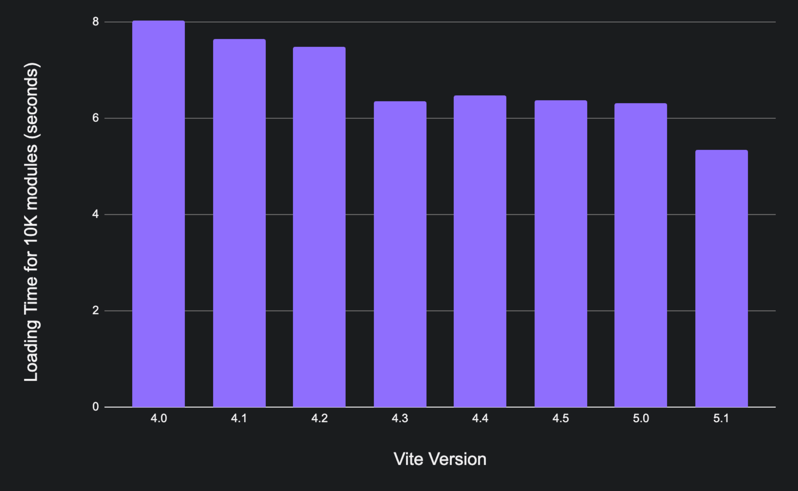

# Vite 5.1 is out!

_February 8, 2024_

Vite 5 [was released](./announcing-vite5.md) last November, and it represented another big leap for Vite and the ecosystem. A few weeks ago we celebrated 10 million weekly npm downloads and 900 contributors to the Vite repo. Today, we're excited to announce the release of Vite 5.1.

Quick links: [Docs](/), [Changelog](https://github.com/vitejs/vite/blob/main/packages/vite/CHANGELOG.md#510-2024-02-08)

Docs in other languages: [简体中文](https://cn.vite.dev/), [日本語](https://ja.vite.dev/), [Español](https://es.vite.dev/), [Português](https://pt.vite.dev/), [한국어](https://ko.vite.dev/), [Deutsch](https://de.vite.dev/)

Try Vite 5.1 online in StackBlitz: [vanilla](https://vite.new/vanilla-ts), [vue](https://vite.new/vue-ts), [react](https://vite.new/react-ts), [preact](https://vite.new/preact-ts), [lit](https://vite.new/lit-ts), [svelte](https://vite.new/svelte-ts), [solid](https://vite.new/solid-ts), [qwik](https://vite.new/qwik-ts).

If you're new to Vite, we suggest reading first the [Getting Started](/guide/) and [Features](/guide/features) guides.

To stay up to date, follow us on [X](https://x.com/vite_js) or [Mastodon](https://webtoo.ls/@vite).

## Vite Runtime API

Vite 5.1 adds experimental support for a new Vite Runtime API. It allows running any code by processing it with Vite plugins first. It is different from `server.ssrLoadModule` because the runtime implementation is decoupled from the server. This lets library and framework authors implement their own layer of communication between the server and the runtime. This new API is intended to replace Vite's current SSR primitives once it is stable.

The new API brings many benefits:

- Support for HMR during SSR.
- It is decoupled from the server, so there is no limit on how many clients can use a single server - every client has its own module cache (you can even communicate with it how you want - using message channel/fetch call/direct function call/websocket).
- It doesn't depend on any node/bun/deno built-in APIs, so it can run in any environment.
- It's easy to integrate with tools that have their own mechanism to run code (you can provide a runner to use `eval` instead of `new AsyncFunction` for example).

The initial idea [was proposed by Pooya Parsa](https://github.com/nuxt/vite/pull/201) and implemented by [Anthony Fu](https://github.com/antfu) as the [vite-node](https://github.com/vitest-dev/vitest/tree/main/packages/vite-node#readme) package to [power Nuxt 3 Dev SSR](https://antfu.me/posts/dev-ssr-on-nuxt) and later also used as the base for [Vitest](https://vitest.dev). So the general idea of vite-node has been battle-tested for quite some time now. This is a new iteration of the API by [Vladimir Sheremet](https://github.com/sheremet-va), who had already re-implemented vite-node in Vitest and took the learnings to make the API even more powerful and flexible when adding it to Vite Core. The PR was one year in the makings, you can see the evolution and discussions with ecosystem maintainers [here](https://github.com/vitejs/vite/issues/12165).

::: info
The Vite Runtime API evolved into the Module Runner API, released in Vite 6 as part of the [Environment API](/guide/api-environment).
:::

## Features

### Improved support for `.css?url`

Import CSS files as URLs now works reliably and correctly. This was the last remaining hurdle in Remix's move to Vite. See ([#15259](https://github.com/vitejs/vite/issues/15259)).

### `build.assetsInlineLimit` now supports a callback

Users can now [provide a callback](/config/build-options.html#build-assetsinlinelimit) that returns a boolean to opt-in or opt-out of inlining for specific assets. If `undefined` is returned, the default logic applies. See ([#15366](https://github.com/vitejs/vite/issues/15366)).

### Improved HMR for circular import

In Vite 5.0, accepted modules within circular imports always triggered a full page reload even if they can be handled fine in the client. This is now relaxed to allow HMR to apply without a full page reload, but if any error happens during HMR, the page will be reloaded. See ([#15118](https://github.com/vitejs/vite/issues/15118)).

### Support `ssr.external: true` to externalize all SSR packages

Historically, Vite externalizes all packages except for linked packages. This new option can be used to force externalize all packages including linked packages too. This is handy in tests within monorepos where we want to emulate the usual case of all packages externalized, or when using `ssrLoadModule` to load an arbitrary file and we want to always external packages as we don't care about HMR. See ([#10939](https://github.com/vitejs/vite/issues/10939)).

### Expose `close` method in the preview server

The preview server now exposes a `close` method, which will properly teardown the server including all opened socket connections. See ([#15630](https://github.com/vitejs/vite/issues/15630)).

## Performance improvements

Vite keeps getting faster with each release, and Vite 5.1 is packed with performance improvements. We measured the loading time for 10K modules (25 level deep tree) using [vite-dev-server-perf](https://github.com/yyx990803/vite-dev-server-perf) for all minor versions from Vite 4.0. This is a good benchmark to measure the effect of Vite's bundle-less approach. Each module is a small TypeScript file with a counter and imports to other files in the tree, so this mostly measuring the time it takes to do the requests a separate modules. In Vite 4.0, loading 10K modules took 8 seconds on a M1 MAX. We had a breakthrough in [Vite 4.3 were we focused on performance](./announcing-vite4-3.md), and we were able to load them in 6.35 seconds. In Vite 5.1, we managed to do another performance leap. Vite is now serving the 10K modules in 5.35 seconds.

The results of this benchmark run on Headless Puppeteer and are a good way to compare versions. They don't represent the time as experienced by users though. When running the same 10K modules in an Incognito window is Chrome, we have:

| 10K Modules           | Vite 5.0 | Vite 5.1 |
| --------------------- | :------: | :------: |
| Loading time          |  2892ms  |  2765ms  |
| Loading time (cached) |  2778ms  |  2477ms  |
| Full reload           |  2003ms  |  1878ms  |
| Full reload (cached)  |  1682ms  |  1604ms  |

### Run CSS preprocessors in threads

Vite now has opt-in support for running CSS preprocessors in threads. You can enable it using [`css.preprocessorMaxWorkers: true`](/config/shared-options.html#css-preprocessormaxworkers). For a Vuetify 2 project, dev startup time was reduced by 40% with this feature enabled. There is [performance comparison for others setups in the PR](https://github.com/vitejs/vite/pull/13584#issuecomment-1678827918). See ([#13584](https://github.com/vitejs/vite/issues/13584)). [Give Feedback](https://github.com/vitejs/vite/discussions/15835).

### New options to improve server cold starts

You can set `optimizeDeps.holdUntilCrawlEnd: false` to switch to a new strategy for deps optimization that may help in big projects. We're considering switching to this strategy by default in the future. [Give Feedback](https://github.com/vitejs/vite/discussions/15834). ([#15244](https://github.com/vitejs/vite/issues/15244))

### Faster resolving with cached checks

The `fs.cachedChecks` optimization is now enabled by default. In Windows, `tryFsResolve` was ~14x faster with it, and resolving ids overall got a ~5x speed up in the triangle benchmark. ([#15704](https://github.com/vitejs/vite/issues/15704))

### Internal performance improvements

The dev server had several incremental performance gains. A new middleware to short-circuit on 304 ([#15586](https://github.com/vitejs/vite/issues/15586)). We avoided `parseRequest` in hot paths ([#15617](https://github.com/vitejs/vite/issues/15617)). Rollup is now properly lazy loaded ([#15621](https://github.com/vitejs/vite/issues/15621))

## Deprecations

We continue to reduce Vite's API surface where possible to make the project maintainable long term.

### Deprecated `as` option in `import.meta.glob`

The standard moved to [Import Attributes](https://github.com/tc39/proposal-import-attributes), but we don't plan to replace `as` with a new option at this point. Instead, it is recommended that the user switches to `query`. See ([#14420](https://github.com/vitejs/vite/issues/14420)).

### Removed experimental build-time pre-bundling

Build-time pre-bundling, an experimental feature added in Vite 3, is removed. With Rollup 4 switching its parser to native, and Rolldown being worked on, both the performance and the dev-vs-build inconsistency story for this feature are no longer valid. We want to continue improving dev/build consistency, and have concluded that using Rolldown for "prebundling during dev" and "production builds" is the better bet moving forward. Rolldown may also implement caching in a way that is a lot more efficient during build than deps prebundling. See ([#15184](https://github.com/vitejs/vite/issues/15184)).

## Get Involved

We are grateful to the [900 contributors to Vite Core](https://github.com/vitejs/vite/graphs/contributors), and the maintainers of plugins, integrations, tools, and translations that keeps pushing the ecosystem forward. If you're enjoying Vite, we invite you to participate and help us. Check out our [Contributing Guide](https://github.com/vitejs/vite/blob/main/CONTRIBUTING.md), and jump into [triaging issues](https://github.com/vitejs/vite/issues), [reviewing PRs](https://github.com/vitejs/vite/pulls), answering questions at [GitHub Discussions](https://github.com/vitejs/vite/discussions) and helping others in the community in [Vite Land](https://chat.vite.dev).

## Acknowledgments

Vite 5.1 is possible thanks to our community of contributors, maintainers in the ecosystem, and the [Vite Team](/team). A shout out to the individuals and companies sponsoring Vite development. [StackBlitz](https://stackblitz.com/), [Nuxt Labs](https://nuxtlabs.com/), and [Astro](https://astro.build) for hiring Vite team members. And also to the sponsors on [Vite's GitHub Sponsors](https://github.com/sponsors/vitejs), [Vite's Open Collective](https://opencollective.com/vite), and [Evan You's GitHub Sponsors](https://github.com/sponsors/yyx990803).
