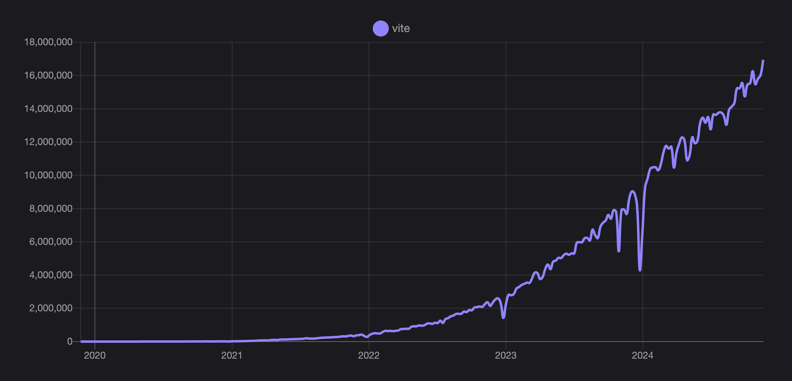

# Vite 6.0 is out!

_November 26, 2024_

Today, we're taking another big step in Vite's story. The Vite [team](/team), [contributors](https://github.com/vitejs/vite/graphs/contributors), and ecosystem partners are excited to announce the release of Vite 6.

It has been an eventful year. Vite adoption keeps growing, with npm downloads per week jumping from 7.5 million to 17 million since the release of Vite 5 a year ago. [Vitest](https://vitest.dev) is not only being favored more by users but is also starting to form an ecosystem of its own. For example, [Storybook](https://storybook.js.org) has new testing capabilities powered by Vitest.

New frameworks have also joined the Vite ecosystem, including [TanStack Start](https://tanstack.com/start), [One](https://onestack.dev/), [Ember](https://emberjs.com/), and others. Web frameworks are innovating at an increasingly faster pace. You can check out the improvements folks have been doing at [Astro](https://astro.build/), [Nuxt](https://nuxt.com/), [SvelteKit](https://kit.svelte.dev/), [Solid Start](https://www.solidjs.com/blog/introducing-solidstart), [Qwik City](https://qwik.builder.io/qwikcity/overview/), [RedwoodJS](https://redwoodjs.com/), [React Router](https://reactrouter.com/), and the list goes on.

Vite is used by OpenAI, Google, Apple, Microsoft, NASA, Shopify, Cloudflare, GitLab, Reddit, Linear, among many others. Two months ago, we started a list of [companies using Vite](https://github.com/vitejs/companies-using-vite). We're happy to see many developers sending us a PR to add their companies to the list. It's hard to believe how much the ecosystem we built together has grown since Vite gave its first steps.

## Speeding up the Vite ecosystem

Last month, the community gathered for the third edition of [ViteConf](https://viteconf.org/24/replay), hosted once more by [StackBlitz](https://stackblitz.com). It was the biggest Vite conference, with a broad representation of builders from the ecosystem. Among other announcements, Evan You announced [VoidZero](https://staging.voidzero.dev/posts/announcing-voidzero-inc), a company dedicated to building an open-source, high-performance, and unified development toolchain for the JavaScript ecosystem. VoidZero is behind [Rolldown](https://rolldown.rs) and [Oxc](https://oxc.rs), and their team is making significant strides, getting them rapidly ready for being adopted by Vite. Watch Evan's keynote to learn more about the next steps for Vite's rust-powered future.

<YouTubeVideo videoId="EKvvptbTx6k?si=EZ-rFJn4pDW3tUvp" />

[Stackblitz](https://stackblitz.com) unveiled [bolt.new](https://bolt.new), a Remix app that combines Claude and WebContainers and lets you prompt, edit, run, and deploy full-stack apps. Nate Weiner announced [One](https://onestack.dev/), a new Vite-powered React framework for web and native. Storybook showcased their latest Vitest-powered [testing features](https://youtu.be/8t5wxrFpCQY?si=PYZoWKf-45goQYDt). And so much more. We encourage you to watch [all 43 talks](https://www.youtube.com/playlist?list=PLqGQbXn_GDmnObDzgjUF4Krsfl6OUKxtp). The speakers made a significant effort to share with us what each project has been up to.

Vite also got a refreshed landing page and a clean domain. You should update your URLs to point to the new [vite.dev](https://vite.dev) domain moving forward. The new design and implementation was done by VoidZero, by the same folks that made their website. Shoutout to [Vicente Rodriguez](https://bento.me/rmoon) and [Simon Le Marchant](https://marchantweb.com/).

## The next Vite major is here

Vite 6 is the most significant major release since Vite 2. We're eager to partner with the ecosystem to keep expanding our shared commons through new APIs and, as usual, a more polished base upon which to build.

Quick links:

- [Docs](/)
- Translations: [简体中文](https://cn.vite.dev/), [日本語](https://ja.vite.dev/), [Español](https://es.vite.dev/), [Português](https://pt.vite.dev/), [한국어](https://ko.vite.dev/), [Deutsch](https://de.vite.dev/)
- [Migration Guide](/guide/migration)
- [GitHub Changelog](https://github.com/vitejs/vite/blob/main/packages/vite/CHANGELOG.md#600-2024-11-26)

If you're new to Vite, we suggest reading the [Getting Started](/guide/) and [Features](/guide/features) guides first.

We want to thank the more than [1K contributors to Vite Core](https://github.com/vitejs/vite/graphs/contributors) and the maintainers and contributors of Vite plugins, integrations, tools, and translations that have helped us craft this new major. We invite you to get involved and help us improve Vite for the whole ecosystem. Learn more at our [Contributing Guide](https://github.com/vitejs/vite/blob/main/CONTRIBUTING.md).

To get started, we suggest helping [triage issues](https://github.com/vitejs/vite/issues), [review PRs](https://github.com/vitejs/vite/pulls), send failing tests PRs based on open issues, and support others in [Discussions](https://github.com/vitejs/vite/discussions) and Vite Land's [help forum](https://discord.com/channels/804011606160703521/1019670660856942652). If you'd like to talk to us, join our [Discord community](https://chat.vite.dev) and say hi on the [#contributing channel](https://discord.com/channels/804011606160703521/804439875226173480).

For the latest news about the Vite ecosystem and Vite core, follow us on [Bluesky](https://bsky.app/profile/vite.dev), [X](https://twitter.com/vite_js), or [Mastodon](https://webtoo.ls/@vite).

## Getting started with Vite 6

You can use `pnpm create vite` to quickly scaffold a Vite app with your preferred framework or play online with Vite 6 using [vite.new](https://vite.new). You can also run `pnpm create vite-extra` to get access to templates from other frameworks and runtimes (Solid, Deno, SSR, and library starters). `create vite-extra` templates are also available when you run `create vite` under the `Others` option.

The Vite starter templates are intended to be used as a playground to test Vite with different frameworks. When building your next project, you should reach out to the starter recommended by each framework. `create vite` also provides a shortcut to setup proper starters by some frameworks, like `create-vue`, `Nuxt 3`, `SvelteKit`, `Remix`, `Analog`, and `Angular`.

## Node.js Support

Vite 6 supports Node.js 18, 20, and 22+, similar to Vite 5. Node.js 21 support has been dropped. Vite drops Node.js support for older versions after their [EOL](https://endoflife.date/nodejs). The Node.js 18 EOL is at the end of April 2025, after which we may release a new major to bump the required Node.js version.

## Experimental Environment API

Vite is getting more flexible with the new Environment API. These new APIs will allow framework authors to offer a dev experience closer to production and for the Ecosystem to share new building blocks. Nothing changes if you're building a SPA; when you use Vite with a single client environment, everything works as before. And even for custom SSR apps, Vite 6 is backward compatible. The primary target audience for Environment API is framework authors.

For end users who are curious, [Sapphi](https://github.com/sapphi-red) wrote a great [Introduction to Environment API](https://green.sapphi.red/blog/increasing-vites-potential-with-the-environment-api) guide. It is a great place to start and understand why we're trying to make Vite even more flexible.

If you are a framework author or Vite plugin maintainer and would like to leverage the new APIs, you can learn more at the [Environment API Guides](https://main.vite.dev/guide/api-environment).

We want to thank everyone involved in defining and implementing the new APIs. The story begins with Vite 2 adopting the unbundled SSR dev scheme pioneered by [Rich Harris](https://github.com/Rich-Harris) and the [SvelteKit](https://svelte.dev/docs/kit) team. Vite's SSR transform then unlocked [Anthony Fu](https://github.com/antfu/) and [Pooya Parsa](https://github.com/pi0) to create vite-node and improve [Nuxt's Dev SSR story](https://antfu.me/posts/dev-ssr-on-nuxt). Anthony went to use vite-node to power [Vitest](https://vitest.dev), and [Vladimir Sheremet](https://github.com/sheremet-va) kept improving it as part of his work maintaining Vitest. At the beginning of 2023, Vladimir started working to upstream vite-node to Vite Core, and we released it as Runtime API in Vite 5.1 a year later. Feedback from ecosystem partners (special shout-out to the Cloudflare team) pushed us to do a more ambitious rework of Vite's environments. You can learn more about the story at [Patak's ViteConf 24 talk](https://www.youtube.com/watch?v=WImor3HDyqU?si=EZ-rFJn4pDW3tUvp).

Everyone on the Vite team participated in defining the new API, which was co-designed with feedback from many projects in the Ecosystem. Thanks to everyone involved! We encourage you to get involved if you're building a framework, plugin, or tool on top of Vite. The new APIs are experimental. We will work with the Ecosystem to review how the new APIs will be used and stabilize them for the next major. If you'd like to ask questions or give feedback, there is an [open GitHub discussion here](https://github.com/vitejs/vite/discussions/16358).

## Main Changes

- [Default value for `resolve.conditions`](/guide/migration#default-value-for-resolve-conditions)
- [JSON stringify](/guide/migration#json-stringify)
- [Extended support of asset references in HTML elements](/guide/migration#extended-support-of-asset-references-in-html-elements)
- [postcss-load-config](/guide/migration#postcss-load-config)
- [Sass now uses modern API by default](/guide/migration#sass-now-uses-modern-api-by-default)
- [Customize CSS output file name in library mode](/guide/migration#customize-css-output-file-name-in-library-mode)
- [And more changes that should only affect a few users](/guide/migration#advanced)

There is also a new [Breaking Changes](/changes/) page that lists all planned, considering, and past changes in Vite.

## Migrating to Vite 6

For most projects, the update to Vite 6 should be straightforward, but we advise reviewing the [detailed Migration Guide](/guide/migration) before upgrading.

The complete list of changes is at the [Vite 6 Changelog](https://github.com/vitejs/vite/blob/main/packages/vite/CHANGELOG.md#500-2024-11-26).

## Acknowledgments

Vite 6 results from long work hours by our community of contributors, downstream maintainers, plugin authors, and the [Vite Team](/team). We appreciate the individuals and companies sponsoring Vite development. Vite is brought to you by [VoidZero](https://voidzero.dev), in partnership with [StackBlitz](https://stackblitz.com/), [Nuxt Labs](https://nuxtlabs.com/), and [Astro](https://astro.build). A shout-out to sponsors on [Vite's GitHub Sponsors](https://github.com/sponsors/vitejs) and [Vite's Open Collective](https://opencollective.com/vite).
