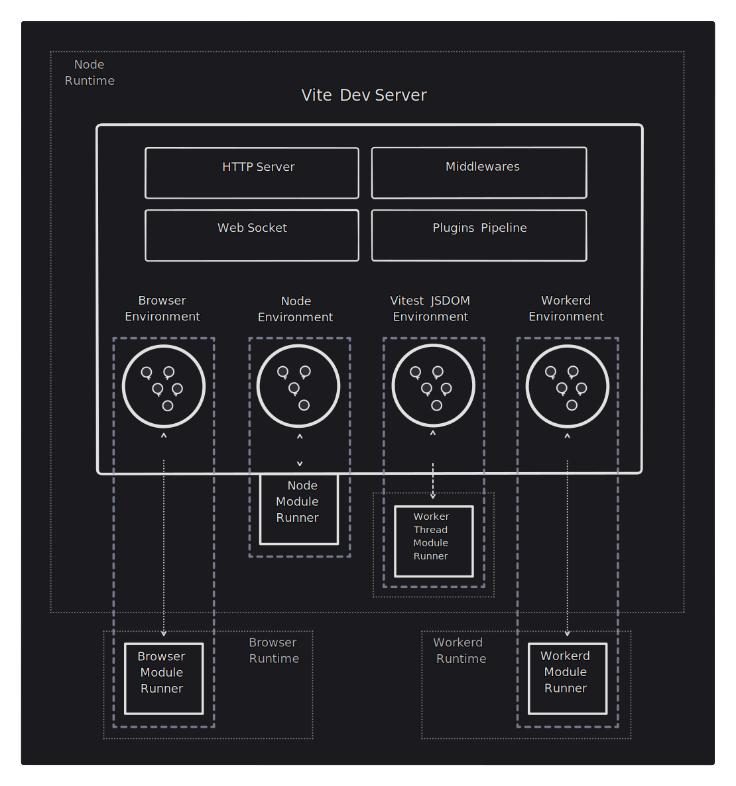

# Environment API

:::info Release Candidate
The Environment API is generally in the release candidate phase. We'll maintain stability in the APIs between major releases to allow the ecosystem to experiment and build upon them. However, note that [some specific APIs](/changes/#considering) are still considered experimental.

We plan to stabilize these new APIs (with potential breaking changes) in a future major release once downstream projects have had time to experiment with the new features and validate them.

Resources:

- [Feedback discussion](https://github.com/vitejs/vite/discussions/16358) where we are gathering feedback about the new APIs.
- [Environment API PR](https://github.com/vitejs/vite/pull/16471) where the new API were implemented and reviewed.

Please share your feedback with us.
:::

## Formalizing Environments

Vite 6 formalizes the concept of Environments. Until Vite 5, there were two implicit Environments (`client`, and optionally `ssr`). The new Environment API allows users and framework authors to create as many environments as needed to map the way their apps work in production. This new capability required a big internal refactoring, but a lot of effort has been placed on backward compatibility. The initial goal of Vite 6 is to move the ecosystem to the new major as smoothly as possible, delaying the adoption of the APIs until enough users have migrated and frameworks and plugin authors have validated the new design.

## Closing the Gap Between Build and Dev

For a simple SPA/MPA, no new APIs around environments are exposed to the config. Internally, Vite will apply the options to a `client` environment, but it's not necessary to know of this concept when configuring Vite. The config and behavior from Vite 5 should work seamlessly here.

When we move to a typical server-side rendered (SSR) app, we'll have two environments:

- `client`: runs the app in the browser.
- `ssr`: runs the app in node (or other server runtimes) which renders pages before sending them to the browser.

In dev, Vite executes the server code in the same Node process as the Vite dev server, giving a close approximation to the production environment. However, it is also possible for servers to run in other JS runtimes, like [Cloudflare's workerd](https://github.com/cloudflare/workerd) which have different constraints. Modern apps may also run in more than two environments, e.g. a browser, a node server, and an edge server. Vite 5 didn't allow to properly represent these environments.

Vite 6 allows users to configure their app during build and dev to map all of its environments. During dev, a single Vite dev server can now be used to run code in multiple different environments concurrently. The app source code is still transformed by Vite dev server. On top of the shared HTTP server, middlewares, resolved config, and plugins pipeline, the Vite dev server now has a set of independent dev environments. Each of them is configured to match the production environment as closely as possible, and is connected to a dev runtime where the code is executed (for workerd, the server code can now run in miniflare locally). In the client, the browser imports and executes the code. In other environments, a module runner fetches and evaluates the transformed code.



## Environments Configuration

For an SPA/MPA, the configuration will look similar to Vite 5. Internally these options are used to configure the `client` environment.

```js
export default defineConfig({
  build: {
    sourcemap: false,
  },
  optimizeDeps: {
    include: ['lib'],
  },
})
```

This is important because we'd like to keep Vite approachable and avoid exposing new concepts until they are needed.

If the app is composed of several environments, then these environments can be configured explicitly with the `environments` config option.

```js
export default {
  build: {
    sourcemap: false,
  },
  optimizeDeps: {
    include: ['lib'],
  },
  environments: {
    server: {},
    edge: {
      resolve: {
        noExternal: true,
      },
    },
  },
}
```

When not explicitly documented, environment inherits the configured top-level config options (for example, the new `server` and `edge` environments will inherit the `build.sourcemap: false` option). A small number of top-level options, like `optimizeDeps`, only apply to the `client` environment, as they don't work well when applied as a default to server environments. The `client` environment can also be configured explicitly through `environments.client`, but we recommend to do it with the top-level options so the client config remains unchanged when adding new environments.

The `EnvironmentOptions` interface exposes all the per-environment options. There are environment options that apply to both `build` and `dev`, like `resolve`. And there are `DevEnvironmentOptions` and `BuildEnvironmentOptions` for dev and build specific options (like `dev.warmup` or `build.outDir`). Some options like `optimizeDeps` only applies to dev, but is kept as top level instead of nested in `dev` for backward compatibility.

```ts
interface EnvironmentOptions {
  define?: Record<string, any>
  resolve?: EnvironmentResolveOptions
  optimizeDeps: DepOptimizationOptions
  consumer?: 'client' | 'server'
  dev: DevOptions
  build: BuildOptions
}
```

The `UserConfig` interface extends from the `EnvironmentOptions` interface, allowing to configure the client and defaults for other environments, configured through the `environments` option. The `client` and a server environment named `ssr` are always present during dev. This allows backward compatibility with `server.ssrLoadModule(url)` and `server.moduleGraph`. During build, the `client` environment is always present, and the `ssr` environment is only present if it is explicitly configured (using `environments.ssr` or for backward compatibility `build.ssr`). An app doesn't need to use the `ssr` name for its SSR environment, it could name it `server` for example.

```ts
interface UserConfig extends EnvironmentOptions {
  environments: Record<string, EnvironmentOptions>
  // other options
}
```

Note that the `ssr` top-level property is going to be deprecated once the Environment API is stable. This option has the same role as `environments`, but for the default `ssr` environment and only allowed configuring of a small set of options.

## Custom Environment Instances

Low level configuration APIs are available so runtime providers can provide environments with proper defaults for their runtimes. These environments can also spawn other processes or threads to run the modules during dev in a closer runtime to the production environment.

```js
import { customEnvironment } from 'vite-environment-provider'

export default {
  build: {
    outDir: '/dist/client',
  },
  environments: {
    ssr: customEnvironment({
      build: {
        outDir: '/dist/ssr',
      },
    }),
  },
}
```

## Backward Compatibility

The current Vite server API is not yet deprecated and is backward compatible with Vite 5.

The `server.moduleGraph` returns a mixed view of the client and ssr module graphs. Backward compatible mixed module nodes will be returned from all its methods. The same scheme is used for the module nodes passed to `handleHotUpdate`.

We don't recommend switching to Environment API yet. We are aiming for a good portion of the user base to adopt Vite 6 before so plugins don't need to maintain two versions. Checkout the future breaking changes section for information on future deprecations and upgrade path:

- [`this.environment` in Hooks](/changes/this-environment-in-hooks)
- [HMR `hotUpdate` Plugin Hook](/changes/hotupdate-hook)
- [Move to Per-environment APIs](/changes/per-environment-apis)
- [SSR Using `ModuleRunner` API](/changes/ssr-using-modulerunner)
- [Shared Plugins During Build](/changes/shared-plugins-during-build)

## Target Users

This guide provides the basic concepts about environments for end users.

Plugin authors have a more consistent API available to interact with the current environment configuration. If you're building on top of Vite, the [Environment API Plugins Guide](./api-environment-plugins.md) guide describes the way extended plugin APIs available to support multiple custom environments.

Frameworks could decide to expose environments at different levels. If you're a framework author, continue reading the [Environment API Frameworks Guide](./api-environment-frameworks) to learn about the Environment API programmatic side.

For Runtime providers, the [Environment API Runtimes Guide](./api-environment-runtimes.md) explains how to offer custom environment to be consumed by frameworks and users.
