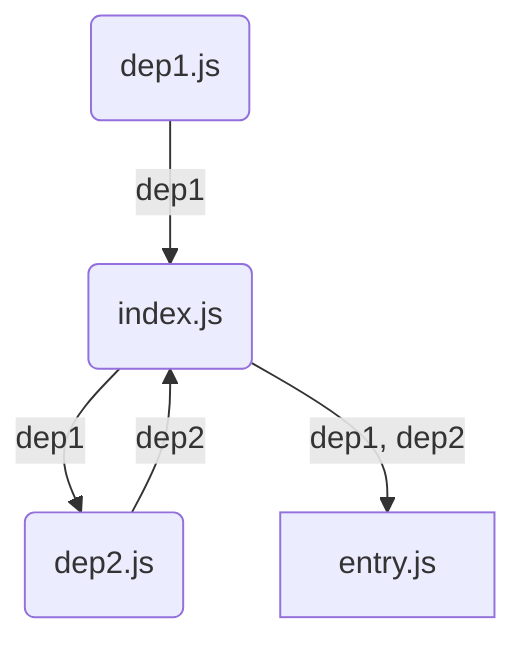
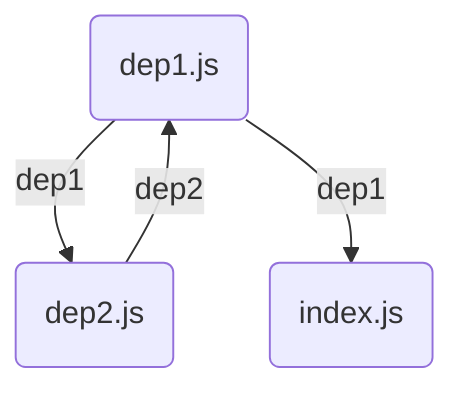

- `test1` - `test5`

Cyclic import example based on https://github.com/vitejs/vite/issues/14048#issuecomment-2354774156

```mermaid
flowchart TD
    B(dep1.js) -->|dep1| A(index.js)
    A -->|dep1| C(dep2.js)
    C -->|dep2| A
    A -->|dep1, dep2| entry.js
```

---

- `test6`

```mermaid
flowchart TD
    A(dep1.js) -->|dep1| B
    B(dep2.js) -->|dep2| A
    A -->|dep1| C(index.js)
```
